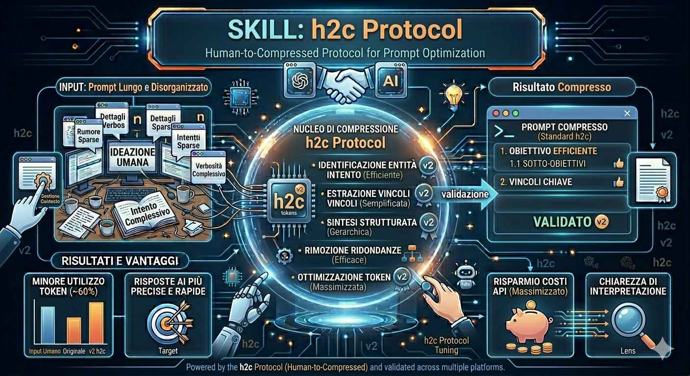

# H2C Semantic Compression Protocol

**Protocollo di comunicazione AI-to-AI.** Grammatica a blocchi compressi per orchestrazione agenti, retrieval cognitivo e trasporto di ragionamento.



```
Protocollo: H2C v1.3
Stato:      DRAFT (validato)
Licenza:    MIT
Specifica:  SPEC.md
```

> **NON** è HTTP/2 h2c (RFC 7540). HTTP/2 h2c è un meccanismo di upgrade in chiaro per connessioni HTTP/1.1. Questo H2C è un **protocollo di compressione semantica per comunicazione AI-to-AI**, grammaticalmente e funzionalmente indipendente. Vedi [Confronto con alternative](docs/comparisons/vs-alternatives.md) per la disambiguazione completa.

---

## Visione

I sistemi multi-agente oggi comunicano in linguaggio naturale — verboso, ridondante, non analizzabile. Ogni piano architetturale costa 500–2000 token. Ogni ciclo build-test-fix brucia migliaia di token. Spiegazioni, cortesie, markdown e ripetizioni dominano il cablaggio.

H2C sostituisce il linguaggio naturale con una grammatica a blocchi strutturata progettata per il parsing nativo da LLM. È un **protocollo di compressione semantica**: lossless a livello informativo, compatto a livello di token.

Non è un formato di prompt. È un **wire protocol per agenti AI.**

---

## Perché Esiste

| Problema | Impatto | Soluzione H2C |
|----------|---------|---------------|
| Spreco token in catene di agenti | 5.000–50.000 token per workflow | 200–2.000 token, stessa informazione |
| Nessun protocollo agenti analizzabile | Orchestrator leggono testo libero | Blocchi strutturati con campi tipizzati |
| Saturazione context window | Collasso dopo ~40 messaggi NL | Triade PRUNE/COMPACT/FREEZE scala a 130+ messaggi |
| Fragilità cross-modello | Prompt falliscono tra famiglie di modelli | Grammatica autodescrittiva, zero-shot cross-modello |
| Nessun handoff versionato tra agenti | Gli agenti non possono riprendere conversazioni | `rev`/`base_rev`, `cycle_id`, `STATE:FINDINGS` |

---

## Architettura

```
┌─────────────────────────────────────────────────────┐
│                   Pipeline Agenti                     │
│                                                       │
│  [Umano] → [Architetto] → [Orchestratore] → [Builder]│
│                                          ↕            │
│                                      [Tester]         │
│                                                       │
│  Formato:  [TIPO:SOTTOTIPO] chiave:val|chiave:val|...│
│  Trasporto: stdin/stdout | HTTP | WebSocket | MCP     │
└─────────────────────────────────────────────────────┘
```

### Modello a Strati

| Strato | Componente | Ruolo |
|--------|------------|-------|
| **Trasporto** | MCP, stdin/stdout, HTTP, WebSocket | Trasporta blocchi H2C tra agenti |
| **Semantico** | Grammatica a blocchi H2C | Definisce significato, stato e flusso |
| **Orchestrazione** | cycle_id, retry_n, PRUNE/COMPACT/FREEZE | Gestisce catene di agenti di lunga durata |
| **Applicativo** | Skill agente (skills/*.md) | Mappa blocchi H2C a comportamento agente |

---

## Sintassi (Grammatica Core)

```
[TIPO:SOTTOTIPO]
chiave1:valore1|chiave2:valore2|...

TIPO     ::= "ARCH" | "BUILD" | "TEST" | "CTX" | "STATE" | "ORCH" | "SKILL"
SOTTOTIPO::= "PLAN" | "EXEC" | "DONE" | "FIX" | "REVERT" | "RUN" | "PASS"
           | "FAIL" | "PRIMITIVES" | "UPDATE" | "PRUNE" | "COMPACT" | "FREEZE"
           | "FINDINGS" | "ACK" | "END" | "PROMPT"
```

I campi sono coppie chiave-valore tipizzate con separatore `|`. Liste usano `[a,b,c]`. Revisioni usano `file~N`. Vedi [SPEC.md](SPEC.md) e [docs/specification/grammar.md](docs/specification/grammar.md).

### Esempio Minimo

```
[ARCH:PLAN]
id:api-meteo|fw:python3.11|lib:fastapi,httpx,cachetools|auth:APIKey::env(OPENWEATHER_API_KEY)|struct:[main.py,routers/weather.py,services/weather_service.py]|notes:[cache_TTL_10min,rate-limit_60req-min]

[BUILD:EXEC]
id:m1|target:main.py|desc:setup_fastapi_app

[BUILD:DONE]
id:m1|diff:[main.py~1]|rev:1

[ORCH:END]
final:complete|est_token:15
```

Questo sostituisce ~180 token di linguaggio naturale con ~55 token (~70% di risparmio, validato su Claude Sonnet 4.6, Opus 4.7).

---

## Esempi

| Esempio | Descrizione | Risparmio |
|---------|-------------|---------|
| [API Meteo](examples/api-meteo.md) | Servizio meteo Python/FastAPI vs prompt NL | ~65% |
| [TODO Console](examples/todo-console.md) | App console C# .NET 8 con SQLite vs NL | ~59% |
| [Catena PRUNE/COMPACT](examples/prune_demo.md) | Catena v1.3 completa con gestione contesto | ~80% |
| [Test Opus 4.7](opus4_7/REPORT.md) | 5 scenari, fino a 130 messaggi | ~78–83% |

---

## Benchmark (Validati)

| Metrica | Linguaggio Naturale | H2C | Miglioramento |
|---------|:-:|:-:|:-----------:|
| Piano architetturale | ~800 token | ~50 token | ~94% |
| Esito build | ~200 token | ~15 token | ~93% |
| Ciclo 3 agenti | ~5.000 token | ~200 token | ~96% |
| Catena stress 130 msg | ~42.000 token | ~7.140 token | ~83% |
| Punto di rottura contesto | ~40 messaggi NL | ~130 messaggi H2C | ~3,25x |
| Zero-shot cross-modello | Fallisce spesso | Funziona su 4 famiglie | — |

Metodologia e tabelle comparative complete: [docs/benchmarks/comparison.md](docs/benchmarks/comparison.md)

---

## Casi d'Uso

- **Orchestrazione multi-agente**: Cicli Architetto → Builder → Tester con tracciamento retry
- **Catene di agenti di lunga durata**: Conversazioni 100+ messaggi con pruning contesto
- **Handoff LLM-to-LLM**: Agente A produce output strutturato per Agente B senza parsing NL
- **IR Cognitivo**: Compressione semantica per retrieval-augmented generation
- **Trasporto ragionamento**: Trasportare catene di ragionamento intermedio compresse tra chiamate LLM
- **Protocollo runtime agenti**: Formato standard per piattaforme di hosting agenti

---

## Integrazione Ecosistema

H2C è il **layer semantico**; i framework esistenti fungono da **layer di trasporto**:

| Framework | Modello di Integrazione |
|-----------|-------------------------|
| **MCP** | Blocchi H2C trasportati come contenuto tool call MCP |
| **LangGraph** | H2C come formato output nodo, schema stato |
| **AutoGen** | H2C come protocollo risposta agente |
| **Semantic Kernel** | H2C come serializzazione risultato funzione |
| **CrewAI** | H2C come formato output task |
| **OpenAI Agents SDK** | H2C come formato output strutturato |

Vedi [docs/ecosystem/integrations.md](docs/ecosystem/integrations.md).

---

## Roadmap del Progetto

| Fase | Cosa | Stato |
|------|------|-------|
| v1.0 | Grammatica core, blocchi base | RILASCIATO |
| v1.1 | PRUNE/COMPACT, rev, fail/pass count | RILASCIATO |
| v1.2 | FREEZE, cycle_id obbligatorio, retry_n, rinomina skill | RILASCIATO |
| v1.3 | EBNF formale (ISO 14977), modello AST, opcode semantici, macchina stati completa | RILASCIATO |
| v1.4 | BNF grammar signed_int, ~progress separatore uniforme, DAG cycle detection | PIANIFICATO |
| v2.0 | Implementazione di riferimento parser, validatore, transpiler | PIANIFICATO |
| v3.0 | Compilatore H2C, trasporto nativo MCP, runtime agenti | RICERCA |

---

## Per Iniziare

```bash
# Clona
git clone https://github.com/PaoEng/H2C.git

# Leggi la specifica
cat SPEC.md

# Esegui una skill (copia come system prompt in qualsiasi LLM)
cat skills/h2c_architect.md

# Esplora benchmark
cat opus4_7/REPORT.md

# Auto-test
cat Test.md
```

Requisiti: Qualsiasi LLM con context window ≥8K. Nessuna libreria. Nessuna dipendenza. Solo testo.

---

## Contributi

Vedi [CONTRIBUTING.md](CONTRIBUTING.md).

---

## Licenza

MIT — Copyright © 2026 **Paolino Salamone**.
